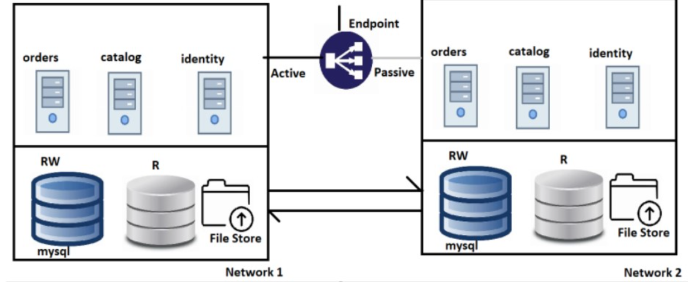
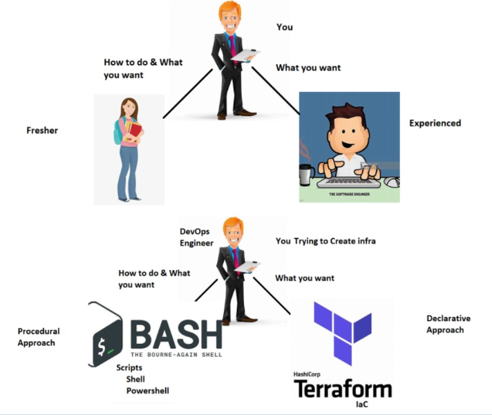
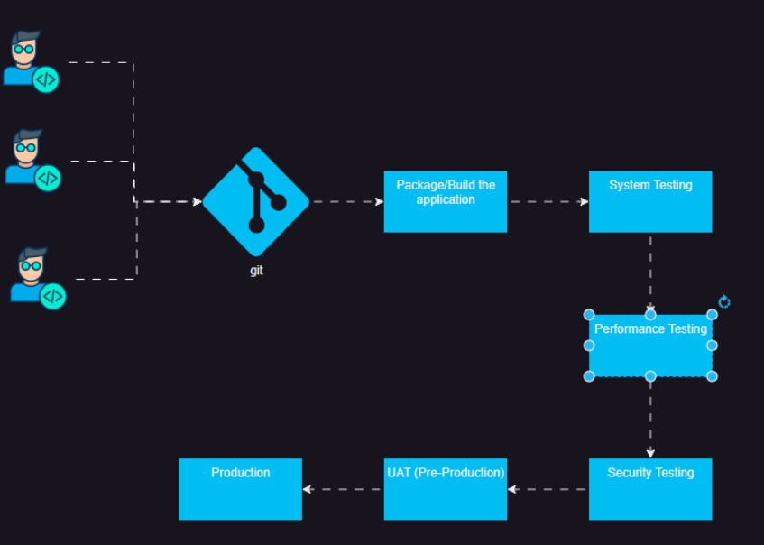
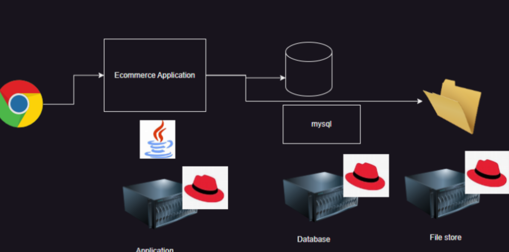
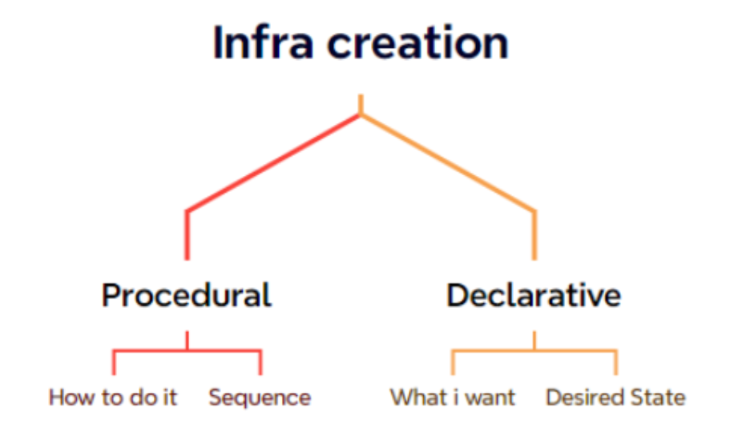

TERRAFORM
----------

* To preview README.md ctrl+shift+v
 
## Problem Statement
* Our fictorious Organization:
    * name: Asquare info systems
    * Product: iEcommerce
    * Purpose: Any Organization can buy this project and host ecommerce  applications 
* This product is designed to work on any virtualized platform such as
    * VMWare
    * OpenStack
    * AWS
    * Azure
    * GCP
* Now Asquare info systems needs to have an apporach to deploy 
  the iEcommerce applicatio into Customers Cloud/Virtual Environments
* Architecture of iECommerce

### Infra for iECommerce
* Two networks with connectivity b/w them 
  (same building, different    buildings, cities, countries)
* In Each network
* Two Databases
    * mysql
    * RAM: 8 GB
    * cpus: 2
    * Disk: 10 TB
  
    * one File Store
    * Size: 10 TB
  
    * 3 Servers:
    * OS: Ubuntu 22.04
    * RAM: 16 GB
    * Cpus: 2
    * Disk: 50 GB
* Solution:
* InfraProvisioning: This represents using Infrastructure as a Code
  and deploy to target environment
### Understanding InfraProvisioning
 * Analogy
  
* We using InfraProvisioing tools where we express our desired state 
  about  infrastructure as code.
* Terraform: Can create infra in almost all the virtual environments
* ARM Templates: Can create infra in Azure
* Cloudformation: Can create infra in AWS
* Infraprovisiong tools use IaC which are generally idempotent
* Idempotance is the property which states execution one time
  or multiple times leads to the same result.
* Reusability is extreemely simple and terraform can also handle
  multiple environments (Developer, QA, UAT/Staging/Production).

# CI/CD Pipeline

* In CI/CD Pipelines we create or expect different environments for testing before release such as 
      * System Test Environment 
      * Performance Test Environment 
      * Stress Test Environment 
      * User Acceptance Testing Environment (Pre-Prod/Staging)

# Lets understand the complication for 3 different architectures

* Monolith E commerce Application
   * In 1 server all of your code  is running  
   * Monolith can be layered
   
   * Architecture  

* if the no. of user is increase then server will also increase 

* Servers used are Generally virtual machines. Your organization have many choices

   * VmWare
   * AWS
   * Azure
   * GCP

* To create infrastructure (as mentioned below), we need a tool to generate infra.
   
   * networking
   * virtual machines
   * storage
   * database

* To create this we have 3 choices
   
   * manual creation
   * scripting (CLIs/Procedural)  

* Declarative Creation using Templates 

* As we have seen in the demonstrations, templating approach 

   * easy to configure
   * repeatable
   * reusable
   * idempotent
   
* Options for Declarative Creation using Templates 

   * AWS: Cloud formation
   * Azure: ARM Templates/Bicep 
   * Terraform (which runs of almost every virtual platform)
   
Terraform
---------

* refer:https://developer.hashicorp.com/terraform?product_intent=terraform for Terraform docs.

* This is Infra as a code tool for declaratively creating infrastructure in almost all virtual platforms (vmware, kvm) and cloud providers (AWS, Azure, GCP,....)

* Alternatives to Terraform

  * ARM Templates, Azure Bicep
       * Can be used in Azure Only
  
  * AWS Cloud formation:
       * Can be used with AWS Only
  
  * Pulumi: As of now terraform is much popular than this.

* Core components of Terraform 

   * Arguments: Inputs
   * Attributes: Outputs
   * Providers: Where to create infrastructure
   * Resource: What infra needs to be create 
   
   * Resource: This is the infrastructure which you want to create
   * Provider: This refers to where you want to create infrastructure
   * The inputs which we express in terraform are called as arguments
   * The output given by terraform is referred as attribute
    
* Steps to Learn Terraform

   * The template in terraform is expressed in Hashicorp Configuration Lanaguage (HCL).
   *  Terms:
      * Provider: Where we want to create resources.
      * resource: The individual infra element to be created
      * module: reusable template.

* WOW (Ways of Working)    
   * Figure out manual steps
   * identify what can change and parametrize
   * Now each step try to use HCL 