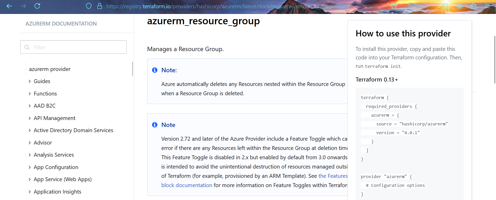
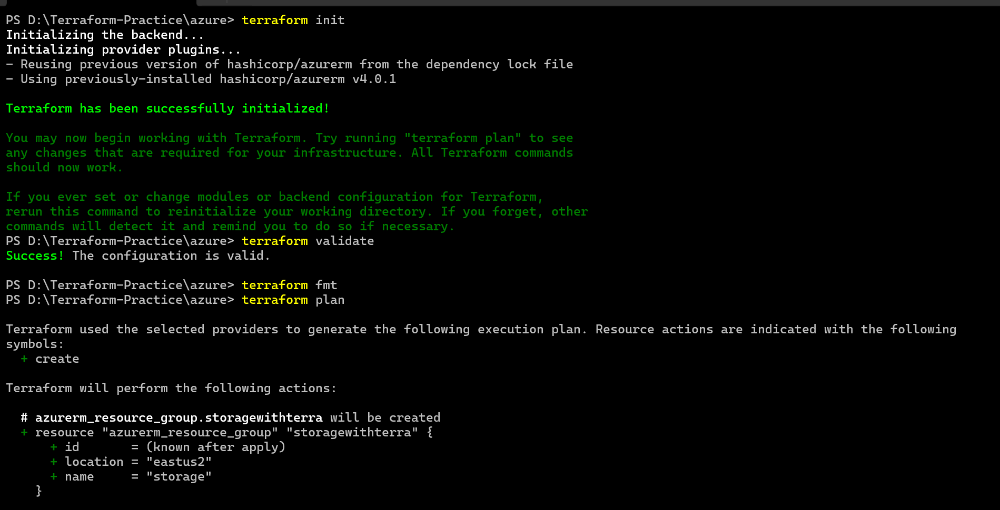
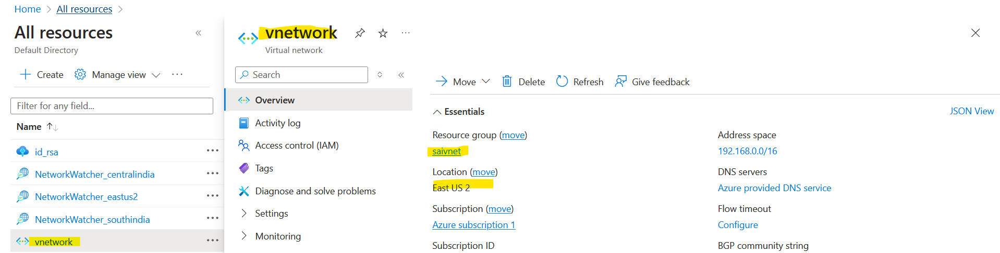

Terraform
---------


* Basic work flow 


* How Terraform Works 

* Overview 


* Terraform is a single executable.
* Terraform has the capability to communicate with multiple clouds or virtualization platforms to create
infra via providers
* Each providers has 
   * Resources: What can be created
   * Datasources: query the cloud/virtualization platform

* We would be creating templates where we define
   * provider : Provider in  terraform is the destination where the resources are supposed to be created.
   * resources : Resource in terraform refers to the infrastructure to be created


* For authoring Templates, Terraform uses declarative approach via a language called as Hashicorp Configuration Language (HCL). 

# Terraform Workflow

Setting up Terraform
---------------------

   * Downloading terraform Refer Here: https://developer.hashicorp.com/terraform/install?ajs_aid=ad146e22-9cfe-4766-89a0-0c947e9072b5&product_intent=terraform
   
* Activity 1: Creating a storage account in Azure
   
   * First Step:
   * Figure out manual steps
       * refer: https://learn.microsoft.com/en-us/azure/storage/common/storage-account-create?tabs=azure-portal    


*    * Azure needs a resource group
     * Create a storage account    


  


* Roughly our inputs
     * resource group name
     * location
     * storage account name
     * Redundancy level

* Create a folder `storage account` and create a file called as `main.tf` 

* Now lets configure provider: 
* refer: https://registry.terraform.io/providers/hashicorp/azurerm/latest


* install azure cli in windows terminal 
* via choco `choco install azure-cli` 
* refer: https://community.chocolatey.org/packages/azure-cli


* The template will be as shown below `azurerm_resource_group`
  

```
terraform {
  required_providers {
    azurerm = {
      source  = "hashicorp/azurerm"
      version = "4.0.1"
    }
  }
}

provider "azurerm" {
  subscription_id = "4e907473-92c1-4fd6-87de-d98d609c6be0"
  features {}
}


resource "azurerm_resource_group" "storagewithterra" {
  name     = "storage"
  location = "East US 2"
}
```


* Terraform provider is downloaded, we need to configure credentials, easiest way to configure credentials is download azure cli 
* Refer Here: https://learn.microsoft.com/en-us/cli/azure/install-azure-cli-windows?tabs=azure-cli
* Once azure cli is installed, launch terminal and execute `az login`
* lets write a resource for resource group


* Now declare the resource

```
resource "azurerm_resource_group" "storagewithterra" {
  name     = "storage"
  location = "East US 2"
}
```

* Execute the workflow 
* Now execute 
 
```
Terraform init
Terraform validate
Terraform fmt
Terraform plan
Terraform apply
Terraform destroy
```



create a storage account in azure 
---------------------------------

```
terraform {
  required_providers {
    azurerm = {
      source  = "hashicorp/azurerm"
      version = "4.0.1"
    }
  }
}

provider "azurerm" {
    subscription_id = "4e907473-063b-9s1m-87de-d98d609c6be0"
  features {}
}


resource "azurerm_resource_group" "storage" {
  name     = "storage"
  location = "East US 2"
}

resource "azurerm_storage_account" "example" {
  name                     = "firststorageofazure"
  resource_group_name      = azurerm_resource_group.storage.name
  location                 = azurerm_resource_group.storage.location
  account_tier             = "Standard"
  account_replication_type = "GRS"

  tags = {
    environment = "staging"
  }
}
```

* Let execute


* Navigate into azure cloud and check it Now validate, fmt and apply to create infra


* Now destroy the resource `Terraform destroy`


Hashicorp Configuration Language
--------------------------------

* __Block syntax__

```
block "name" {
    arg1 = value1
    ..
    argn = valuen
}
```
* Provider Block: This defines where to create resources. 
* refer:https://developer.hashicorp.com/terraform/language/providers/configuration

```
provider "<name>" {
    arg1 = value1
    ..
    argn = valuen
}
```
* __Terraform block:__ 
* Refer Here: for official docs, we use terraform block to specify which provider version can be used and also which terraform version can be use

* __Version Constraints:__ https://developer.hashicorp.com/terraform/language/expressions/version-constraints

* __Datatypes:__ https://developer.hashicorp.com/terraform/language/expressions/types#types

* __Resource block:__
   * Here’s a simple example of a resource block that creates an AWS EC2 instance:

```
resource "aws_instance" "example" {
  ami           = "ami-0c55b159cbfafe1f0"
  instance_type = "t2.micro"
}
```
* or 

```
resource "<type>" "<name>" {
}
```
* type defines type of the resource generally type will be in the form of <provider>_resource =>
azurerm_resource_group

* name here is not the name of the resource that will be generated in provider rather this is reference or
alias to resource for usage with in template

```
resource "azurerm_resource_group" "noname" {
    name = "luckyname" # this is name of resource in azure
}

```

* Generally when you create names use underscores rather than hypens 

Terraform Visual Studio Code Setup
-----------------------------------

* We will be using Terraform Extension in visual studio code 


* __Terraform template basic structure__
    
    * Create a folder with some meaning full name 
    * In this we will creating minimum 4 files all the time 
         * main.tf = The major infra to be created 
         * providers.tf = This file will have provider and terraform configuration 
         * inputs.tf / variables.tf = This files will have variables 
         * outputs.tf = this files has outputs to be shown to the user 

Configuring Azure Provider
--------------------------

* Every Provider in terraform needs credentials.Terraform provides various options to authenticate to Azure 
    * Refer: https://registry.terraform.io/providers/hashicorp/azurerm/latest/docs#authenticating-to-azure

* We will be using the cli credentials
* To declare azure provider we need to create a provider block with name as azurerm

```
provider "azurerm" {
}
```
* Every resource will have documentation of arguments and attributes 


* Lets create resource group and storage account with manually by understanding documentations of Terraform Now
   * refer: https://registry.terraform.io/providers/hashicorp/azurerm/latest/docs/resources/storage_account#argument-reference
    


* In Terminal




* As per in `.tf` files we cerate a resource group name is `manualgrp` and storage account name is `storagenamehai21` so lets check whether it is created or not in same region with same name in azure portal .


* delete now storage account and resource group with `terraform destroy ` command.


--------------------------------------------------------------------------------------------------------------------