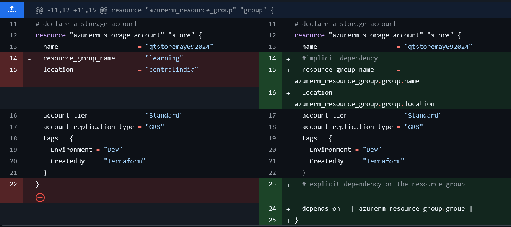
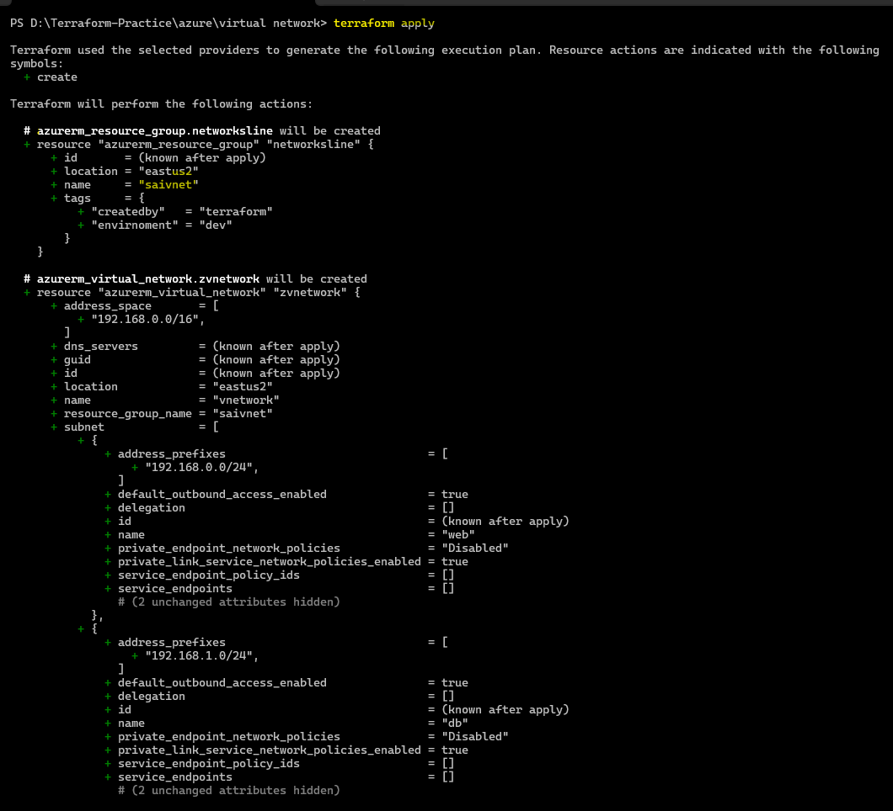
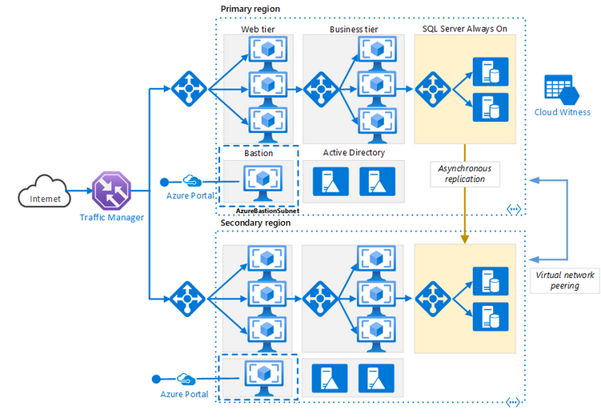
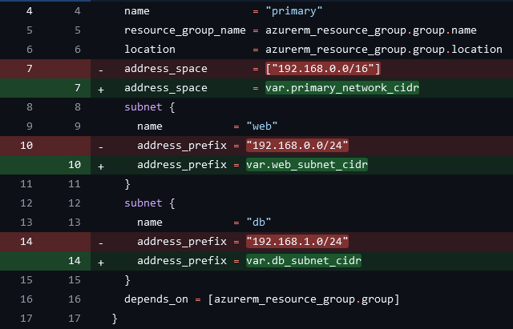
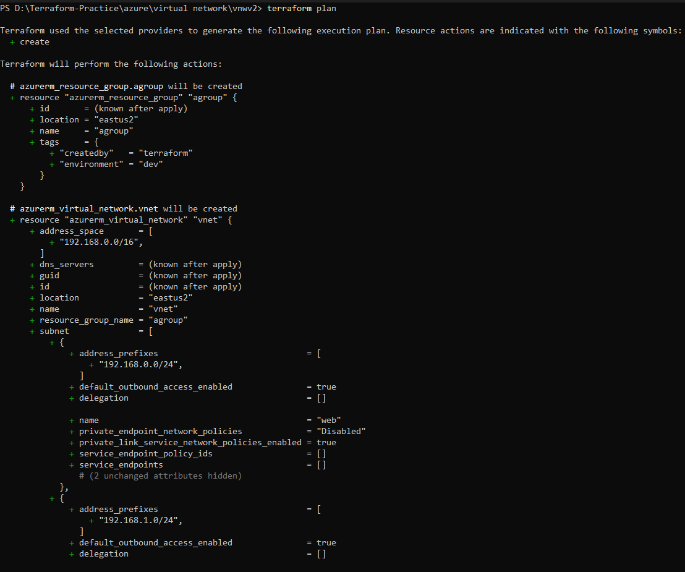
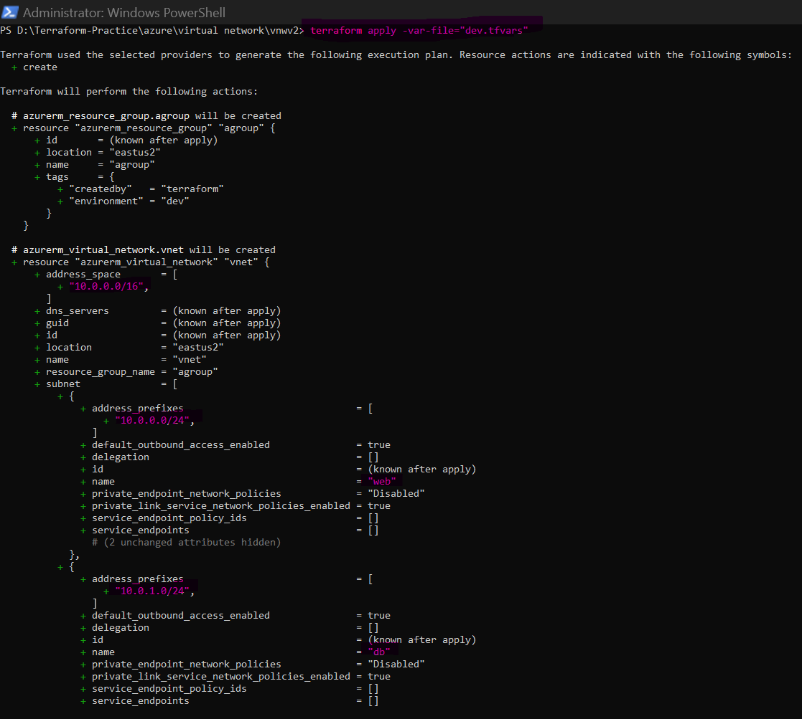
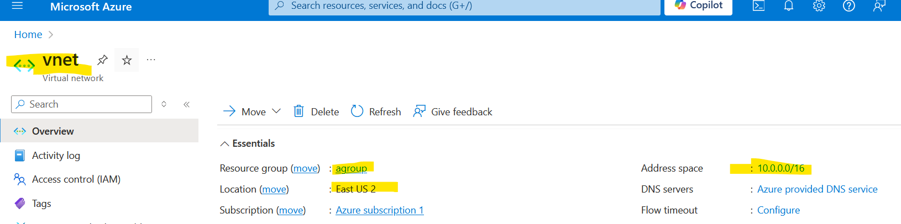

# Day 4th

# to set az cli subscription id : $env:ARM_SUBSCRIPTION_ID = "4e907473-7w1o-4fd6-87fe-d98d491c6be0"
  * {while to setup subscription id in terminal don't forget to use or open terminal with `adminstrative privilage` after setup close terminal and reopen to access }
# Order of Creation

* we have write a template over here of `resource group and storage account`
* Terraform tries to create the resources in parallel if there are no dependencies.
* To specify dependencies we have two ways
    * implicit
    * explicit dependency

* To use the reference of one resource in terraform we use  `<resource-type>.<name>`
* Explicit dependency can be created by adding `depends_on`  in the resource syntax

```
resource "<type>" "name" {
    ...
    ...
    depends_on = [ depend_type.name ]
}
```
*  # explicit dependency on the resource group (explicit dependency give the order to execution which one execute 1st or 1 by 1)

```

# declare a resource group

resource "azurerm_resource_group" "rgroup" {
  name     = "manualgrp"
  location = "East US 2"
  tags = {
    environment = "dev"
    CreatedBy   = "Terraform"
  }
}

# declare a storage account

resource "azurerm_storage_account" "data_store" {
  name                     = "storagenamehai21"
  resource_group_name      = "manualgrp"
  location                 = "East US 2"
  account_tier             = "Standard"
  account_replication_type = "GRS"
  tags = {
    environment = "dev"
    version     = "1.2"
  }
  # explicit dependency on the resource group (explicit dependency give the order to execution which one execute 1st or 1 by 1)
  depends_on = [ azurerm_resource_group.rgroup ]
}
```
* `depends_on = [ azurerm_resource_group.rgroup ]` its trying to tell us i am going to create 2 resources 1st it is creating resource group because it has dependency once it has create then 2nd it will create `storage_account` it is a order of creation.
  
* Implicit dependency: This can be used for creating implicit dependency by using attributes of one resource in another
  
* __Best Practices:__
 
    * Try to always define explicit dependencies even if there are implicit dependencies 
    *  refer here for the changes done to storage account creation with dependencies in below image.
        *  __`depends_on` section will gives an idea to the persion who is looking at this what is the order of creation__ 
        *  if you try to look at this 2 resources we can easly figure out 1st `resource_group` will be created 2nd `storage_account` will create. This is the `best Practice`



```
# declaration of resource group

resource "azurerm_resource_group" "agroup" {
  name     = "sabkagroup"  
  location = "East US 2"

}

# storage account 

resource "azurerm_storage_account" "astorage" {
  name                     = "sabkastorage"
  # implicity dependency on the storage account
  resource_group_name      = azurerm_resource_group.agroup.name
  # implicity dependency on the storage account
  location                 = azurerm_resource_group.agroup.location
  account_tier             = "Standard"
  account_replication_type = "GRS"
  tags = {
    environment = "dev"
    createdby   = "Terraform"
  }

  # explicit dependency on the resource group

  depends_on = [azurerm_resource_group.agroup]
}

```


Creating a Virtual Network in Azure
-----------------------------------

* search on google `virtual network in azure qiuckstart`

* From now onwards if there is 1 variables which you wants to pass `-var` is fine but if you wants  multiple values pass then var-file is fine. 


* can you suggest me any website from where we calculate subnet and ip address?   there is no need to calculate at this stage your architecture generally has those values but if you really want to do that `try to basically go with CIDR try to search that subnetting calculator just google that you will find hell lot of calculator` 

  * This activity will be part of a larger activity which multi region ntier application

  * As of now lets create a basic network in Azure 


# provider `provider.tf`
```
terraform {
  required_providers {
    azurerm = {
      source  = "hashicorp/azurerm"
      version = "4.1.0"
    }
  }
}

provider "azurerm" {
  features {}
}
```
# resource group `main.tf`
```
resource "azurerm_resource_group" "networksline" {
  name     = "saivnet"
  location = "East US 2"
  tags = {
    envirnoment = "dev"
    createdby   = "terraform"
  }

}

``` 
# create a virtual Network `network.tf`
```
resource "azurerm_virtual_network" "zvnetwork" {
  name                = "vnetwork"
  resource_group_name = azurerm_resource_group.networksline.name
  location            = azurerm_resource_group.networksline.location
  address_space       = ["192.168.0.0/16"]
  subnet {
    name             = "web"
    address_prefixes = ["192.168.0.0/24"]
  }

  subnet {
    name             = "db"
    address_prefixes = ["192.168.1.0/24"]
  }

  depends_on = [azurerm_resource_group.networksline]


}
```




   * (whatever i have written is it looking good sir? students are saying yes but sir is saying no. Let me try to tell you what is the problem here it is when you try to run this template every time its create a resource group called as `saivnet` and every time subnet name will be `vnetwork` and every time CIDR ranges are going to be same, so this is me trying to tell that i am going to write function in `Python or any language` for adding 2 numbers
   
   # Multi-region N-tier application
   
   * refer: https://learn.microsoft.com/en-us/azure/architecture/reference-architectures/n-tier/multi-region-sql-server  
   
```
    def add():
      return 5+7

       #you call this function it will always gives you function of 12 ) so is this better or me trying to do  this is better.
    
    def add(a,b):
    return a +b 

       #so what do you think is better one, 2nd one why? because user who is calling has flexibility who can pass any 2 numbers. so this idea is basically called as `parametrization`. 
       
       #so in my above `ntire` architecture name may be `primary` is fine but if customers might want to change location one CIDR range they might want different network or they might want different `ip address`  `10.11.0.0/16` or `10.11.1.0/24` or they want any other something like that we want to give that flexibility so to give this flexibility in `Terraform` we have something called as  __`Variables`__.
   
```  
   
* below images for the changes done in Terraform to create a virtual network with 2 subnet 


 
* The template above works well but always creates the network with same cidr ranges

* Lets make this template dynamic by asking user to pass the cidr range. 
   
   * main.tf
```
# Resource Group

resource "azurerm_resource_group" "agroup" {
  name     = "agroup"
  location = "eastus2"
  tags = {
    environment = "dev"
    createdby   = "terraform"
  }
}

```
   * provider.tf
```
terraform {
  required_providers {
    azurerm = {
      source  = "hashicorp/azurerm"
      version = "4.1.0"
    }
  }
}

provider "azurerm" {
  features {

  }
}
```
  
   * network.tf



```
# virtual network

resource "azurerm_virtual_network" "vnet" {
  name                = "vnet"
  resource_group_name = azurerm_resource_group.agroup.name
  location            = azurerm_resource_group.agroup.location
  address_space       = ["192.168.0.0/16"]
  subnet {
    name             = "web"
    address_prefixes = ["192.168.0.0/24"]
  }
  subnet {
    name             = "db"
    address_prefixes = ["192.168.1.0/24"]
  }
  depends_on = [azurerm_resource_group.agroup]
}

# now 

# create virtual network

resource "azurerm_virtual_network" "vnet" {
  name                = "vnet"
  resource_group_name = azurerm_resource_group.agroup.name
  location            = azurerm_resource_group.agroup.location
  address_space       = var.vnet_network_cidr
  subnet {
    name             = "web"
    address_prefixes = [var.web_subnet_cidr]
  }
  subnet {
    name             = "db"
    address_prefixes = [var.db_subnet_cidr]
  }
  depends_on = [azurerm_resource_group.agroup]
}
```

   * variable.tf


```
# define variables

variable "vnet_network_cidr" {
  type        = list(string)
  description = "This is vnet networks cidr range"
  default     = ["192.168.0.0/16"]
}

variable "web_subnet_cidr" {
  type        = string
  description = "This is web networks cidr"
  default     = "192.168.0.0/24"
}

variable "db_subnet_cidr" {
  type        = string
  description = "This is db subnet cidr"
  default     = "192.168.1.0/24"
}


```


   * dev.tfvars

```
# assigning variable values

vnet_network_cidr = ["10.0.0.0/16"]

web_subnet_cidr = "10.0.0.0/24"

db_subnet_cidr = "10.0.1.0/24"

```
* without passing `dev.tfvars` file , its gives you `variable.tf` file data


* We have use the following command `terraform plan -var-file="dev.tfvars"` or `terraform apply -var-file="dev.tfvars"`

* after passing `dev.tfvars` file 
  
  
  

* Refer Here for the changes **************************************************
  
Exercise
--------

* Try creating a variable for acception the region/location of creation. and resource group name


Terraform Variables
-------------------

* refer: https://developer.hashicorp.com/terraform/language/values/variables

* __variable creation syntax__

```
variable "<name>" {
    type = "string|number|boolean|list|map|set"
    description = "..............."
    default = ""
}
```


* Variable usage syntax `var.<variable-name>`
* Generally create all the variable values in `<env>.tfvars`  and use it while creating/updating infra
