# Terraform contd
   # to set permanent azure login thorough cli `setx ARM_SUBSCRIPTION_ID` 
# Creating multiple subnets

  * Lets try creating multiple subnets using loops in terraform.
  * Loops can be achieved in two ways 
      * count
      * for each

  * Lets use count to create multiple subnets Refer Here: https://developer.hashicorp.com/terraform/language/meta-arguments/count
  
  * Terraform provides functions Refer Here: https://developer.hashicorp.com/terraform/language/functions

  * part 1. 

```
  #azurerm_resource_group

resource "azurerm_resource_group" "group" {
  name     = "group"
  location = "centralIndia"
  tags = {
    environment = "dev"
    CreatedBy   = "Terraform"
  }

}

#create virtual network

resource "azurerm_virtual_network" "primary" {
  name                = "primary"
  resource_group_name = azurerm_resource_group.group.name
  location            = azurerm_resource_group.group.location
  address_space       = var.primary_network_cidr

  subnet {
    name             = "web"
    address_prefixes = [var.web_subnet_cidr]
  }
  subnet {
    name             = "app"
    address_prefixes = [var.db_subnet_cidr]
  }

  depends_on = [azurerm_resource_group.group]
}

#azure provider

terraform {
  required_providers {
    azurerm = {
      source  = "hashicorp/azurerm"
      version = "4.1.0"
    }
  }
}

provider "azurerm" {
  features {

  }
}

# or 

# create virtual network (input variable names)

resource "azurerm_virtual_network" "name" {
  name                = "primary"
  resource_group_name = azurerm_resource_group.group.name
  location            = azurerm_resource_group.group.location
  address_space       = var.azure_virtual_network_cidr
  depends_on          = [azurerm_resource_group.group]
  subnet {
    name             = "web"
    address_prefixes = [var.web_subnet_cidr]
  }

  subnet {
    name             = "db"
    address_prefixes = [var.db_subnet_cidr]
  }

}


#create variables

variable "primary_network_cidr" {
  type        = list(string)
  description = "this is virtual network cidr range"
  default     = ["192.168.0.0/16"]

}

variable "web_subnet_cidr" {
  type        = string
  description = "this is subnet cidr"
  default     = "192.168.o.o/24"

}

variable "db_subnet_cidr" {
  type        = string
  description = "this app subnet cidr"
  default     = "192.168.1.0/24"
}

#assigning variable values

primary_network_cidr = ["10.0.0.0/16"]
web_subnet_cidr      = "10.0.0.0/24"
db_subnet_cidr       = "10.0.1.0/24"


``` 

  * with `terraform plan` 
     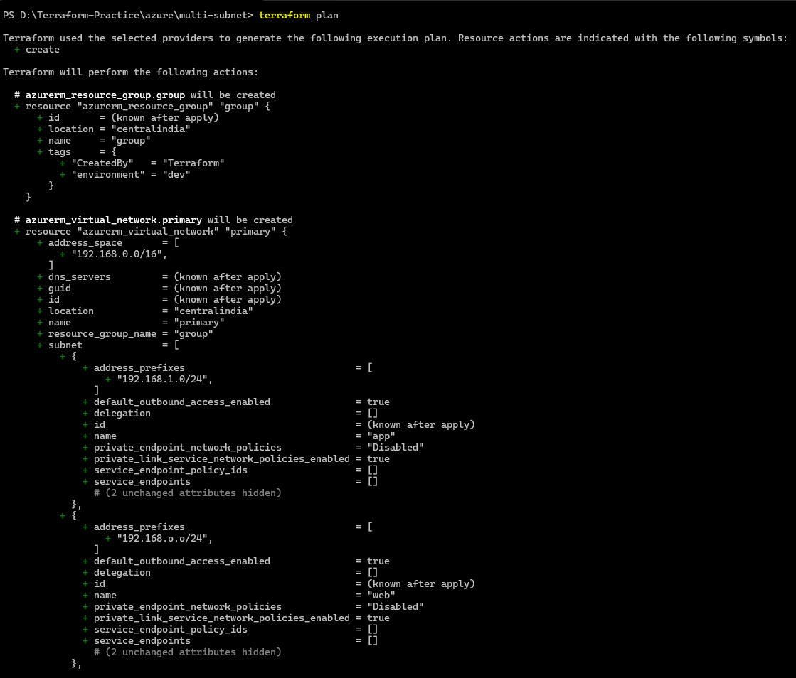
  * with `terraform plan -var-file="dev.tfvars"` and to out of it just type `exit`
     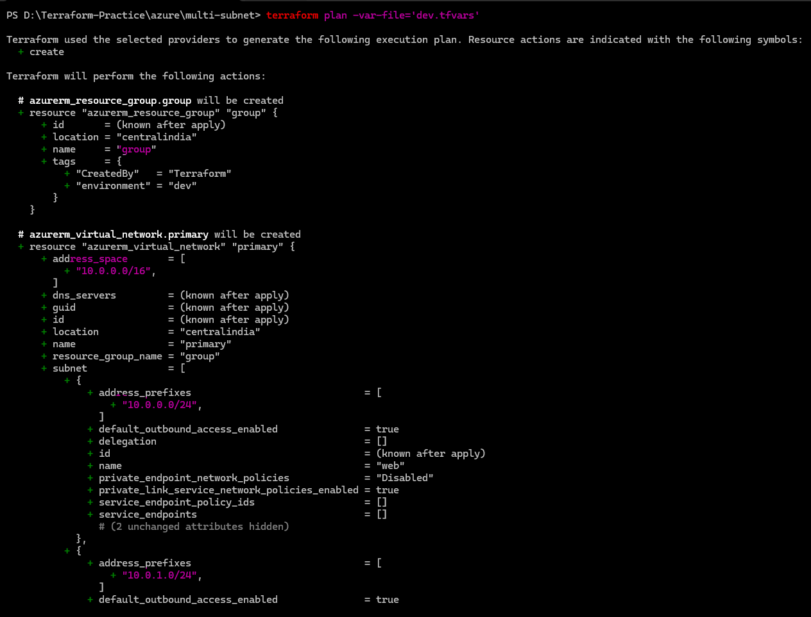
     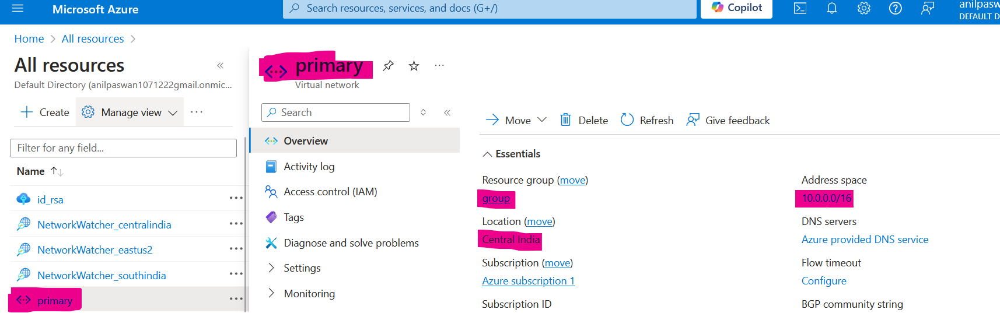
     


# part 2. 

```
# provider


terraform {
  required_providers {
    azurerm = {
      source  = "hashicorp/azurerm"
      version = "4.1.0"
    }
  }
}

provider "azurerm" {
  features {

  }
}

# create resource group

resource "azurerm_resource_group" "group1" {
  name     = "group"
  location = "centralindia"
  tags = {
    Environment = "dev"
    CreatedBy   = "Terraform"
  }

}

# create vartual network

resource "azurerm_virtual_network" "primary" {
  name                = "primary"
  resource_group_name = azurerm_resource_group.group1.name
  address_space       = var.azurerm_virtual_network
  location            = azurerm_resource_group.group1.location
  depends_on          = [azurerm_resource_group.group1]

}


# creating multiple subnets

resource "azurerm_subnet" "subnets" {
  count                = length(var.azurerm_subnet_names)
  name                 = var.azurerm_subnet_names[count.index]
  resource_group_name  = azurerm_resource_group.group1.name
  virtual_network_name = azurerm_virtual_network.primary.name
  address_prefixes     = [var.azurerm_subnet_cidrs[count.index]]

}


# assigning variable values

azurerm_virtual_network = ["10.0.0.0/16"]

azurerm_subnet_names = ["web", "app", "db"]

azurerm_subnet_cidrs = ["10.0.0.0/24", "10.0.1.0/24", "10.0.2.0/24"]

```


   * console `terraform console`
   * pass the variables name  after input command on terminal `terraform console` like  
    ` var.azurerm_subnet_names` , `var.azurerm_subnet_cidrs` and `length(var.azurerm_subnet_names)`
   
   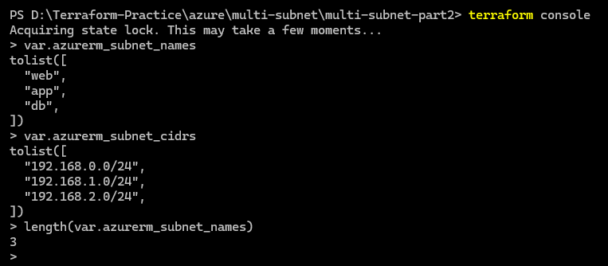
   * `terraform plan` 
   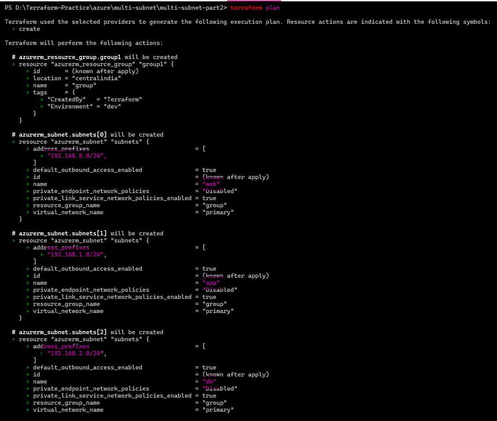 
   *  `terraform apply -var-file="dev.tfvars"`
   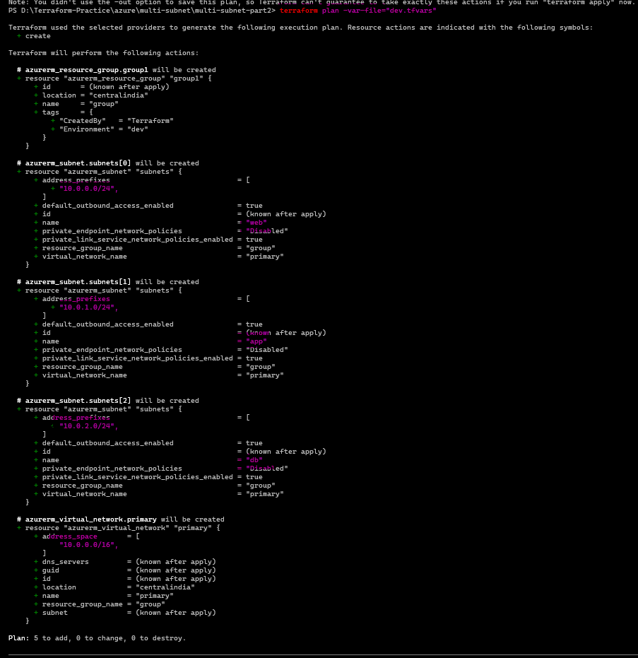  
   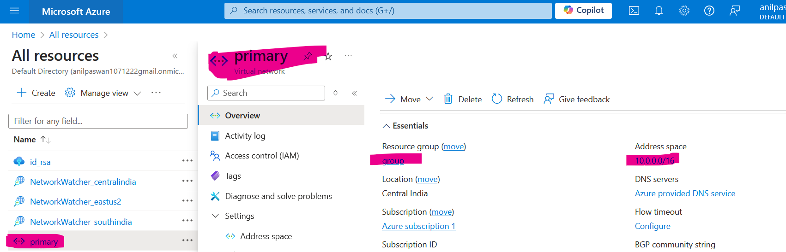
     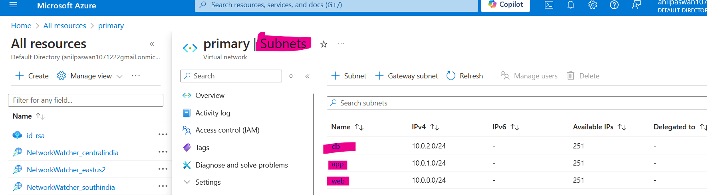

# Terraform for AWS

  # Setup for AWS
     
   * AWS Provider docs: https://registry.terraform.io/providers/hashicorp/aws/latest 
   * Lets setup cli authentication in AWS 
   * Create an IAM User and generate access key and secret access key 

# Activity: Create a vpc
   
   * manual steps 
   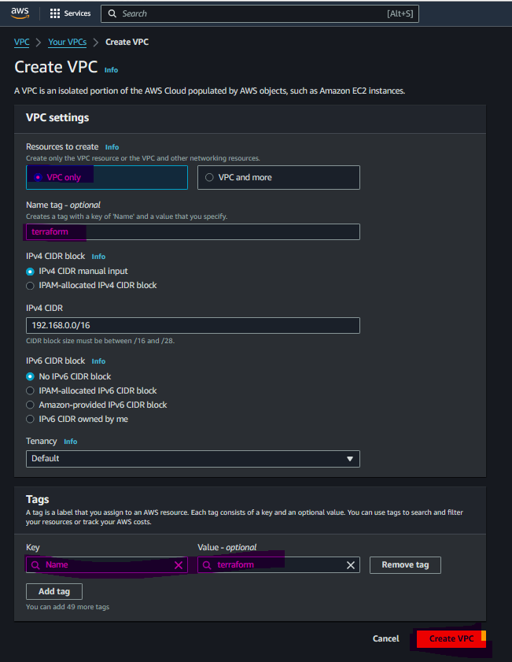 
   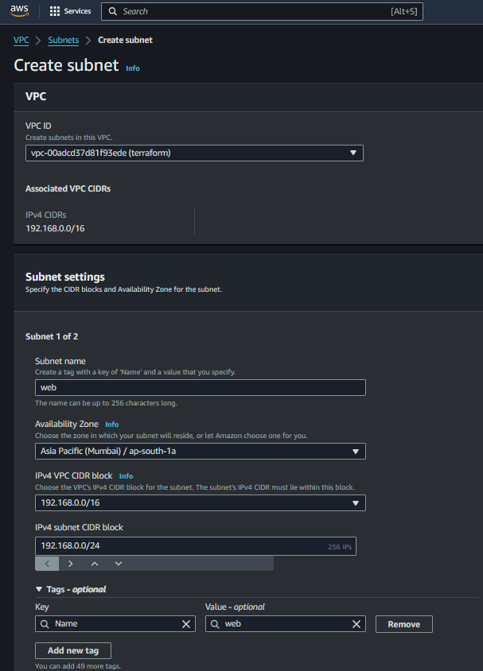
   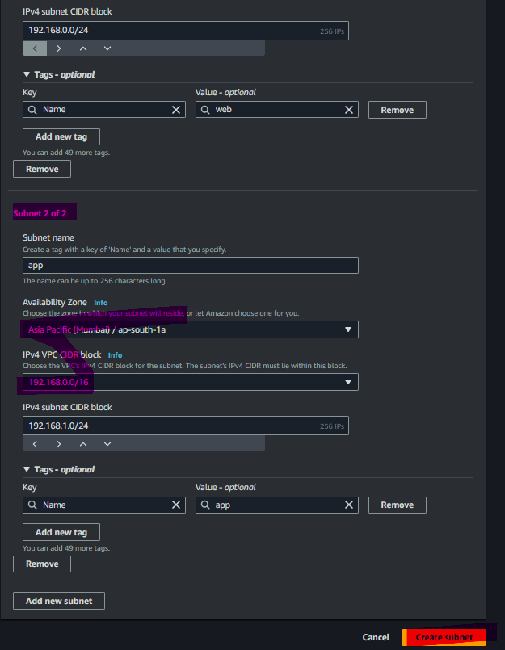
   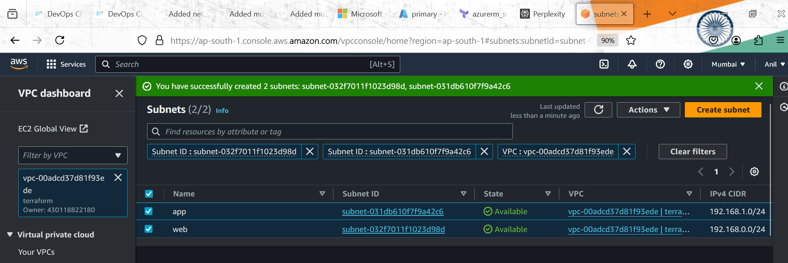
   * vpc resource Refer Here :https://registry.terraform.io/providers/hashicorp/aws/latest/docs/resources/vpc
   * create aws vpc and 4 subnets 
   
   # create vpc in aws 
```
resource "aws_vpc" "first" {
  cidr_block = "10.0.0.0/16"

  tags = {
    Name    = "Terraform"
    Env     = "Dev"
    Project = "Learning"
  }

}
```

# create 4 subnets

```
resource "aws_subnet" "one" {
  availability_zone = "ap-south-1a"
  cidr_block        = "10.0.0.0/24"
  vpc_id            = aws_vpc.first.id

  tags = {
    Name    = "web-1"
    Env     = "Dev"
    Project = "Learning"
  }

}

resource "aws_subnet" "two" {
  availability_zone = "ap-south-1b"
  cidr_block        = "10.0.1.0/24"
  vpc_id            = aws_vpc.first.id

  tags = {
    Name    = "web-2"
    Env     = "Dev"
    Project = "Learning"
  }

}

resource "aws_subnet" "three" {
  availability_zone = "ap-south-1a"
  cidr_block        = "10.0.2.0/24"
  vpc_id            = aws_vpc.first.id

  tags = {
    Name    = "db-1"
    Env     = "Dev"
    Project = "Learning"
  }

}

resource "aws_subnet" "four" {
  availability_zone = "ap-south-1b"
  cidr_block        = "10.0.3.0/24"
  vpc_id            = aws_vpc.first.id
  tags = {
    Name    = "db-2"
    Env     = "Dev"
    Project = "Learning"
  }

}

``` 
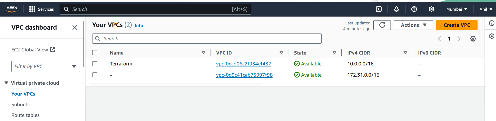
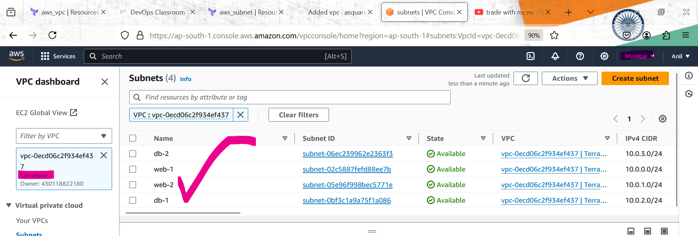

# Activity 2: Create a virtual network in Azure

* we have created a resource group and vertual network and 4 subnets

# 1st way to create a resource

```
# resource group name

resource "azurerm_resource_group" "rgname" {
  name     = "azrgroup"
  location = "eastus2"
  tags = {
    Env       = "Dev"
    CreatedBy = "terraform"
  }
  depends_on = [azurerm_resource_group.rgname]
}

# virtual netwok

resource "azurerm_virtual_network" "vnet" {
  name                = "vnet"
  resource_group_name = azurerm_resource_group.rgname.name
  location            = azurerm_resource_group.rgname.location
  address_space       = ["10.0.0.0/16"]

}


# subnets group 

resource "azurerm_subnet" "vsubnet1" {
  name                 = "vsubnet1"
  resource_group_name  = azurerm_resource_group.rgname.name
  virtual_network_name = azurerm_virtual_network.vnet.name
  address_prefixes     = ["10.0.0.0/24"]

}


resource "azurerm_subnet" "vsubnet2" {
  name                 = "vsubnet2"
  resource_group_name  = azurerm_resource_group.rgname.name
  virtual_network_name = azurerm_virtual_network.vnet.name
  address_prefixes     = ["10.0.1.0/24"]

}

resource "azurerm_subnet" "vsubnet3" {
  name                 = "vsubnet3"
  resource_group_name  = azurerm_resource_group.rgname.name
  virtual_network_name = azurerm_virtual_network.vnet.name
  address_prefixes     = ["10.0.2.0/24"]

}

resource "azurerm_subnet" "vsubnet4" {
  name                 = "vsubnet4"
  resource_group_name  = azurerm_resource_group.rgname.name
  virtual_network_name = azurerm_virtual_network.vnet.name
  address_prefixes     = ["10.0.3.0/24"]

}

```

# Dependencies

 * When a resource in a terraform uses attributes of other resource then an implicit dependency is created i.e the current resource will not be created until the other resource is created
 
 * Dependencies can be made explicit by adding a meta argument `depends_on` 
 * Refer Here: https://developer.hashicorp.com/terraform/language/meta-arguments/depends_on
 
# idempotance

 *  Terraform execution is idempotent as execution irrespective of number of times will give you the same result (i.e desired state) 

# Terraform console
  
  * refer : https://developer.hashicorp.com/terraform/cli/commands/console

# Reasons for writing Template

 * We would want to reuse the terraform templates across various environments and for every environment there will be changes

 * Changes can be in 
      * names
      * values
      * count of items 
 * Try to make terraform template generic not specific
 * Specific example
 
 ```
 def multiply():
    return 10 * 20
 ```
 * Generic

 ```
 # required arguments
 def multiply(a, b):
     return a * b

# default arguments
def multiply(a=10, b=20):
    return a * b
 ``` 

# Activity 1.1: Lets change the vpc template

 * Lets ask the user the vpc cidr range and subnet cidr ranges
 * Lets ask the user for the Name of vpc and subnets
 * Exercise: Try implementing variables

# Activity 2.1: Lets change the virtual network template

 * Lets ask the user the vnet cidr range and subnet cidr ranges
 * Lets ask the user for the Name of virtual network and subnets

# variables
 
 * refer: https://developer.hashicorp.com/terraform/language/values/variables
 * Terraform provides variables where user can set values while applying 
 * Variable definition
 
 ```
 variable "<variable_name>" {
    type =  string | number | bool | map | object | list
    description = 
    default = 
}
 ```
 * Lets look at example

 ```
 # definition
variable "vpc_cidr" {
    type = string
    default = "10.0.0.0/16"
    description = "vpc cidr"
}

resource "aws_vpc" "base" {
    # usage
    cidr_block = var.vpc_cidr
}
 ``` 
 * Good practice is to define all variables in a file called as `variables.tf` or `inputs.tf`
 * Variables can be passed at runtime during apply by adding -var to the apply
 * `terraform apply -var vpc_cidr='192.168.0.0/16'` 


# 2nd way to create a resources

  * in this we create `variables.tf` file 
  
  * main.tf
 ```
 # resource group 

resource "azurerm_resource_group" "redfire" {
  name     = "redfire_g"
  location = "eastus2"
}


# virtual network

resource "azurerm_virtual_network" "vnet" {
  name                = var.virtual_network_name
  resource_group_name = azurerm_resource_group.redfire.name
  location            = azurerm_resource_group.redfire.location
  address_space       = [var.virtual_network_cidr]
}

# subnets

resource "azurerm_subnet" "redfire_web" {
  name                 = var.subnet_names[0]
  resource_group_name  = azurerm_resource_group.redfire.name
  virtual_network_name = azurerm_virtual_network.vnet.name
  address_prefixes     = [var.subnet_cidrs[0]]

}

resource "azurerm_subnet" "redfire_app" {
  name                 = var.subnet_names[1]
  resource_group_name  = azurerm_resource_group.redfire.name
  virtual_network_name = azurerm_virtual_network.vnet.name
  address_prefixes     = [var.subnet_cidrs[1]]

}

resource "azurerm_subnet" "redfire_app-2" {
  name                 = var.subnet_names[2]
  resource_group_name  = azurerm_resource_group.redfire.name
  virtual_network_name = azurerm_virtual_network.vnet.name
  address_prefixes     = [var.subnet_cidrs[2]]

}

resource "azurerm_subnet" "redfire_db" {
  name                 = var.subnet_names[3]
  resource_group_name  = azurerm_resource_group.redfire.name
  virtual_network_name = azurerm_virtual_network.vnet.name
  address_prefixes     = [var.subnet_cidrs[3]]

}


 ```
 * variables.tf
 
 ```
 # variables 

variable "resource_group_name" {
  type    = string
  default = "redfire"

}

variable "resource_group_location" {
  type    = string
  default = "eastus2"

}

variable "virtual_network_name" {
  type    = string
  default = "vnet"

}

variable "virtual_network_cidr" {
  type    = string
  default = "10.0.0.0/16"

}
variable "subnet_names" {
  type    = list(string)
  default = ["redfire_web", "redfire_app", "redfire_app-2", "redfire_db"]

}

variable "subnet_cidrs" {
  type    = list(string)
  default = ["10.0.0.0/24", "10.0.1.0/24", "10.0.2.0/24", "10.0.3.0/24"]

}
 ``` 


* created resource group, virtual network, and 4 subnets
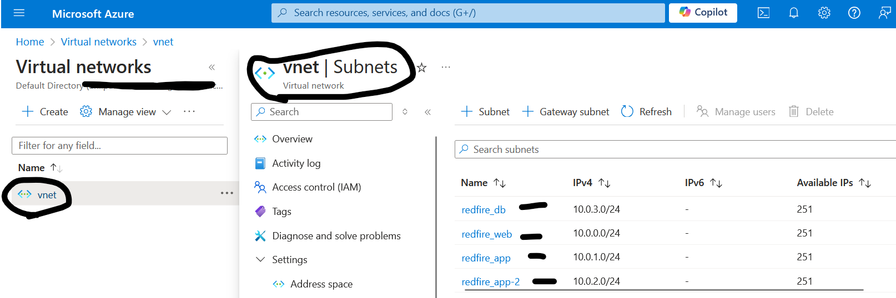 